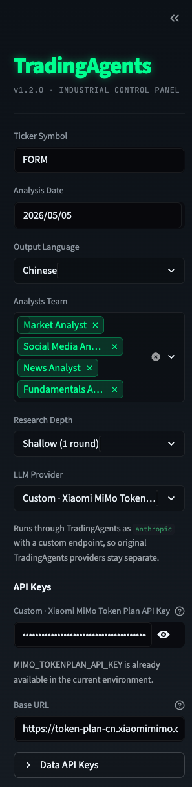
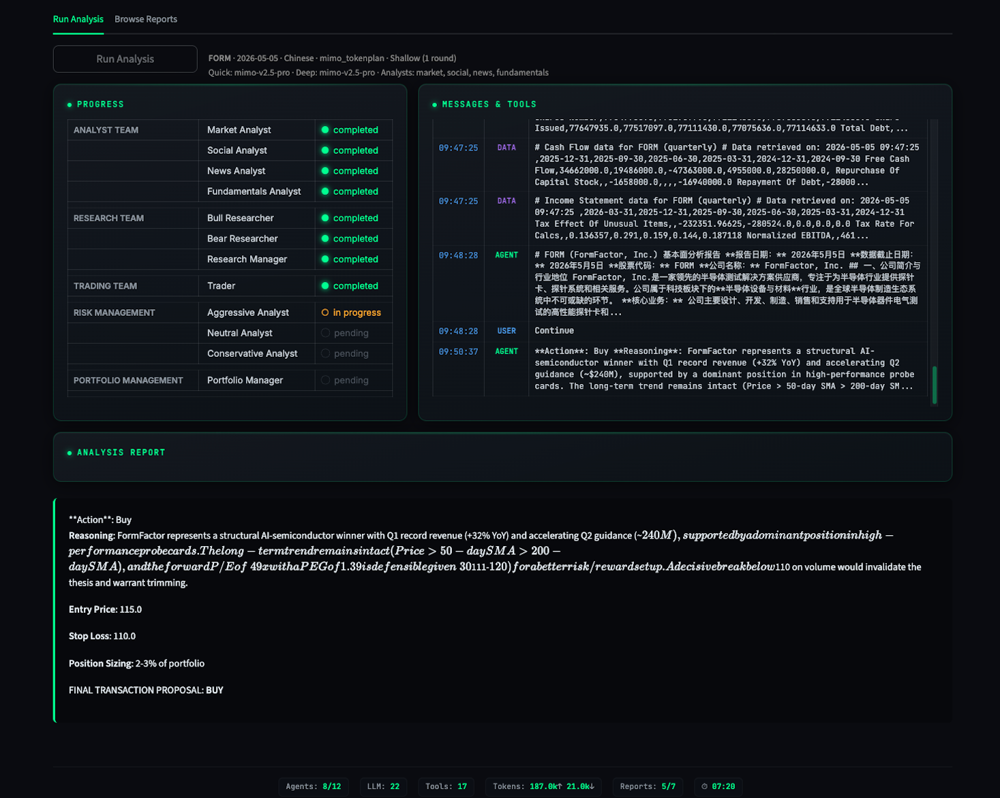
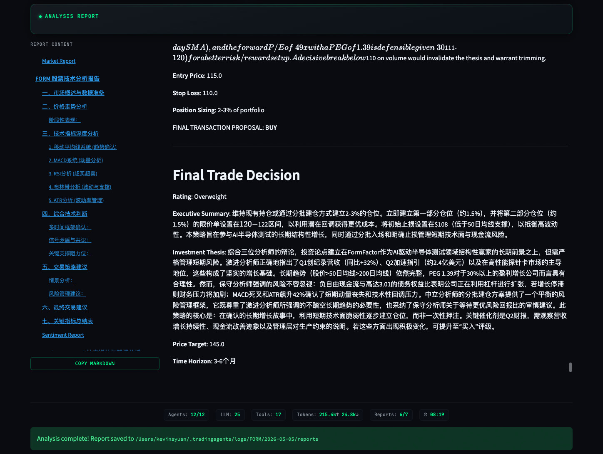
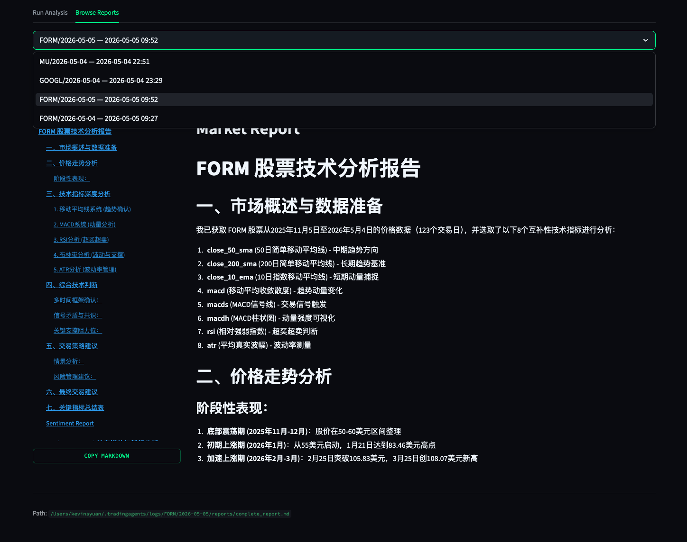

# TradingAgents UI

A lightweight Streamlit web interface for [TradingAgents](https://github.com/TauricResearch/TradingAgents) — Multi-Agents LLM Financial Trading Framework.

## Screenshots

<div style="display:flex;gap:16px;overflow-x:auto;padding:8px 0 16px;scroll-snap-type:x mandatory;">
  <figure style="margin:0;flex:0 0 auto;scroll-snap-align:start;">
    
    <figcaption style="font-size:13px;color:#6b7280;margin-top:6px;">Provider setup</figcaption>
  </figure>
  <figure style="margin:0;flex:0 0 auto;scroll-snap-align:start;">
    
    <figcaption style="font-size:13px;color:#6b7280;margin-top:6px;">Live analysis monitor</figcaption>
  </figure>
  <figure style="margin:0;flex:0 0 auto;scroll-snap-align:start;">
    
    <figcaption style="font-size:13px;color:#6b7280;margin-top:6px;">Report viewer</figcaption>
  </figure>
  <figure style="margin:0;flex:0 0 auto;scroll-snap-align:start;">
    
    <figcaption style="font-size:13px;color:#6b7280;margin-top:6px;">Report history</figcaption>
  </figure>
</div>

## Quick Start

After the one-time install, launch the UI from any terminal:

```bash
trade-ui
```

`trade-ui` checks TradingAgents updates, configures the runtime, and opens the
web app at `http://localhost:8501`.

### Setup (first time)

```bash
git clone <this-repo-url> tradingagents-ui
cd tradingagents-ui
python3 -m pip install -e .
```

Make sure the Python scripts directory is in your `PATH` so the `trade-ui`
command is available. For local development, `./run.sh` launches through the
same `trade-ui` wrapper.

API keys are entered in the Streamlit sidebar and saved to the UI-owned
`~/.tradingagents/.env`. The UI no longer reads `../tradingagents/.env` or
requires a sibling TradingAgents checkout.

## Auto-Update Check

Both `trade-ui` and `./run.sh` check TradingAgents before launching the UI.
If a local TradingAgents git checkout is available, the command compares tags,
offers to pull the latest version, and reinstalls that checkout into the current
Python environment. If the checkout exists but is not installed in the active
Python environment yet, `trade-ui` installs it automatically.

Checkout discovery order:

- `TRADINGAGENTS_DIR` environment variable
- sibling `../tradingagents`
- the installed `tradingagents` package path, if it is an editable git checkout

If no git checkout is found, `trade-ui` can still offer to update the installed
package directly from GitHub. If TradingAgents is not installed at all, it will
prompt to install it before launching the web app. If you decline, `trade-ui`
exits instead of opening a broken UI.

```bash
python3 -m pip install -U git+https://github.com/TauricResearch/TradingAgents.git
```

## Features

- **Live Analysis Execution:** Configure parameters (Ticker, Date, Depth) and trigger multi-agent workflows directly from the sidebar.
- **Real-Time Telemetry:** Monitor agent progress, view live message/tool-call feeds, and track token usage/latency.
- **Live Report Generation:** View analysis reports updating section-by-section as the agents work.
- **Report History:** Browse and render historical Markdown reports from both global and project-specific directories.
- **Persistent State:** Automatic saving of UI preferences and API credentials across sessions.

## Configuration

### Analysis Settings

| Option | Description |
|--------|-------------|
| **Ticker Symbol** | e.g. `SPY`, `NVDA`, `0700.HK` |
| **Analysis Date** | `YYYY-MM-DD` (defaults to today on launch) |
| **Output Language** | English, Chinese, Japanese, etc. |
| **Analysts Team** | Select combinations: Market, Social, News, Fundamentals |
| **Research Depth** | Shallow / Medium / Deep |
| **LLM Provider** | Choose between TradingAgents-native or custom compatible endpoints |

### Environment Variables & API Keys

Provider credentials and configurations are saved to `~/.tradingagents/.env` and loaded automatically. Non-secret preferences are saved to `~/.tradingagents/ui_preferences.json`.

Most providers follow one of these patterns:

- **Native provider:** `<PROVIDER>_API_KEY`  
  Example: `OPENAI_API_KEY`
- **Custom compatible provider:** `<PROVIDER>_API_KEY` + `<PROVIDER>_BASE_URL`  
  Example: `MIMO_API_KEY` + `MIMO_BASE_URL`

Commonly used keys:

- Native: `OPENAI_API_KEY`, `ANTHROPIC_API_KEY`, `OPENROUTER_API_KEY`, `AZURE_OPENAI_API_KEY`
- Custom: `MOONSHOT_API_KEY` + `MOONSHOT_BASE_URL`, `MIMO_API_KEY` + `MIMO_BASE_URL`, `LITELLM_API_KEY` + `LITELLM_BASE_URL`

Azure extra fields: `AZURE_OPENAI_ENDPOINT`, `AZURE_OPENAI_DEPLOYMENT_NAME`, `OPENAI_API_VERSION`  
Data vendor keys (e.g. Alpha Vantage) can be entered under **Data API Keys**.

<details>
<summary>Full supported key list</summary>

Native providers: `OPENAI_API_KEY`, `GOOGLE_API_KEY`, `ANTHROPIC_API_KEY`, `XAI_API_KEY`, `DEEPSEEK_API_KEY`, `DASHSCOPE_API_KEY`, `ZHIPU_API_KEY`, `OPENROUTER_API_KEY`, `AZURE_OPENAI_API_KEY`  
Compatible presets: `GLM_CN_API_KEY`, `GLM_CN_BASE_URL`, `GLM_GLOBAL_API_KEY`, `GLM_GLOBAL_BASE_URL`, `KIMI_API_KEY`, `KIMI_BASE_URL`, `MOONSHOT_API_KEY`, `MOONSHOT_BASE_URL`, `MINIMAX_CN_API_KEY`, `MINIMAX_CN_BASE_URL`, `MINIMAX_GLOBAL_API_KEY`, `MINIMAX_GLOBAL_BASE_URL`, `DEEPSEEK_ANTHROPIC_API_KEY`, `DEEPSEEK_ANTHROPIC_BASE_URL`, `ARK_API_KEY`, `ARK_BASE_URL`, `MIMO_API_KEY`, `MIMO_BASE_URL`, `MIMO_TOKENPLAN_API_KEY`, `MIMO_TOKENPLAN_BASE_URL`, `BAILIAN_API_KEY`, `BAILIAN_BASE_URL`, `OLLAMA_ANTHROPIC_API_KEY`, `OLLAMA_ANTHROPIC_BASE_URL`, `LITELLM_API_KEY`, `LITELLM_BASE_URL`, `CUSTOM_OPENAI_API_KEY`, `CUSTOM_OPENAI_BASE_URL`, `CUSTOM_ANTHROPIC_API_KEY`, `CUSTOM_ANTHROPIC_BASE_URL`

</details>

## Architecture

The UI has been split into focused modules to keep `app.py` readable and reduce merge friction:

- `app.py` coordinates app lifecycle, state, and TradingAgents execution.
- `ui_config.py` stores provider metadata, option lists, and shared constants.
- `ui_styles.py` stores the full Streamlit CSS theme.
- `ui_panels.py` renders Progress / Messages / Stats HTML panels.

### Project Structure

```text
tradingagents-ui/
├── app.py              # Streamlit entrypoint + analysis orchestration
├── ui_config.py        # Providers, model options, team metadata, constants
├── ui_styles.py        # Centralized CUSTOM_CSS theme
├── ui_panels.py        # Progress/messages/stats panel render helpers
├── preferences.py      # Preferences/env persistence
├── trade_ui/
│   ├── __init__.py
│   └── cli.py          # CLI entry point (trade-ui command)
├── pyproject.toml      # Package config with trade-ui script
├── run.sh              # Local launch script
└── .streamlit/
    └── config.toml     # Dark theme config
```
