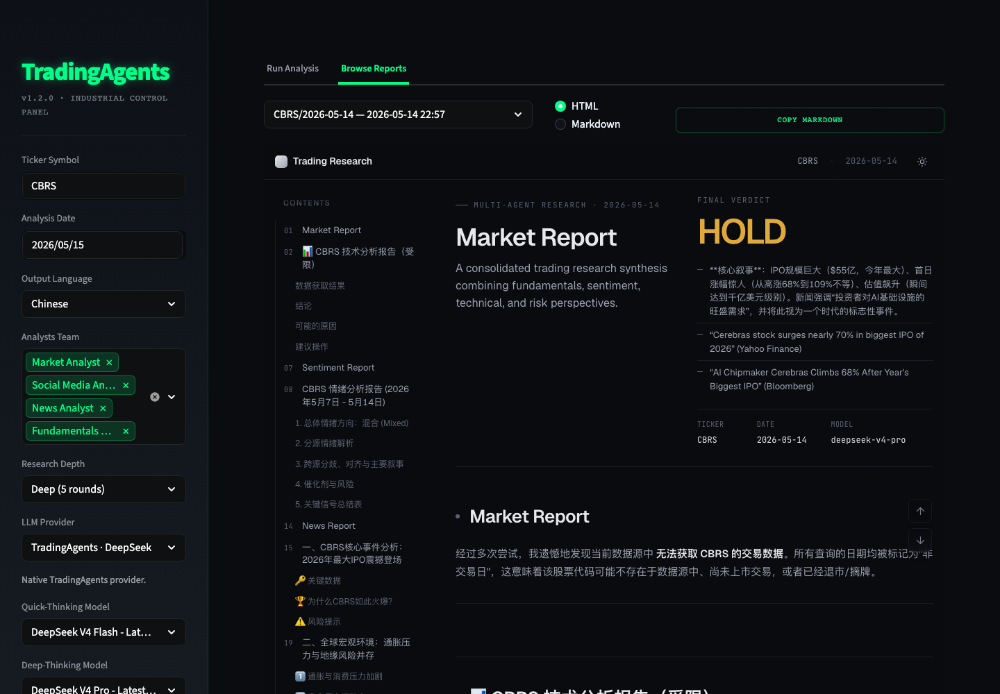

# TradingAgents UI

[English](README.md)

给 [TradingAgents](https://github.com/TauricResearch/TradingAgents) 用的本地 Web App。像普通桌面应用一样打开，填参数，跑分析，在同一个窗口里看报告。



## 一键启动

### macOS

第一次生成 App：

```bash
./scripts/install-macos-app.sh
```

之后双击：

```text
TradingAgents UI.app
```

它会自动启动本地 Streamlit 服务，并用 Chrome/Edge 的独立 App 窗口打开 `http://localhost:8501`。

`TradingAgents UI.app` 是 macOS 专用。Windows 请用下面的 `.bat` 启动器。

### Windows

第一次安装后，双击这个文件即可启动：

```text
scripts\launch-local-webapp.bat
```

它会在后台启动本地服务，并打开：

```text
http://localhost:8501
```

想更像桌面应用，可以给这个 `.bat` 创建桌面快捷方式。

### 所有系统通用

```bash
trade-ui
```

本地开发 checkout 也可以：

```bash
./run.sh
```

## 第一次安装

```bash
git clone https://github.com/Kevoyuan/tradingagents-ui.git
cd tradingagents-ui
python3 -m pip install -e .
```

然后按你的系统选择启动方式：

- macOS：运行 `./scripts/install-macos-app.sh`，以后双击 `TradingAgents UI.app`
- Windows：双击 `scripts\launch-local-webapp.bat`
- Linux/其他：运行 `trade-ui`

## 使用流程

1. 打开本地 UI
2. 左侧填股票代码、日期、语言、分析团队、模型和 API Key
3. 点击 **Run Analysis**
4. 分析完成后打开 **Browse Reports**
5. 默认直接在页面里看 HTML 报告，也可以切换回 Markdown

API Key 会保存在本机，下次打开自动加载。云端部署时不会保存用户 API Key。

## 内置 TradingAgents 更新检查

软件打开时会在后台静默检查一次 GitHub。

如果发现 TradingAgents 有更新，左上角侧边栏的 **TradingAgents** LOGO 旁边会出现一个更新图标。没有更新时，这个图标不会出现。

需要更新时，点击这个图标即可从 GitHub 安装或更新 TradingAgents。更新后建议重启应用，确保已经加载的 Python 模块刷新干净。

## 报告体验

Browse Reports 默认展示内嵌 HTML 报告，不再需要弹出外部浏览器窗口。

你可以：

- 在同一行选择报告、切换 HTML/Markdown、复制 Markdown
- 用报告左侧目录跳到章节
- 用右侧 Top/Bottom 按钮快速到顶部或底部
- 在深色 Quant Terminal 主题里阅读长报告

历史报告保存在：

```text
~/.tradingagents/logs/.../reports/
```

## 手机访问

电脑和手机在同一个 Wi-Fi 下时：

```bash
trade-ui --lan
```

或者：

```bash
./run-lan.sh
```

终端会打印类似：

```text
http://192.168.1.23:8501
```

在手机浏览器打开这个地址即可。报告仍然保存在电脑上，手机只是访问正在运行的本地 Web App。

## 云端部署

想不用保持电脑在线，可以部署到 Streamlit Community Cloud：

1. 把 repo 推到 GitHub
2. 在 Streamlit Community Cloud 新建 app
3. Main file path 填 `app.py`
4. Python 使用 3.10 或更新
5. 不要把 API Key 写进 Secrets 或代码
6. 部署后打开生成的 URL

Cloud 注意事项：

- 每个用户在侧边栏输入自己的 API Key
- Cloud 报告保存在云端容器内，适合临时查看
- Ollama、localhost LiteLLM 这类本地服务不能直接被云端访问

## 功能概览

- 本地一键启动
- macOS 独立窗口 App
- Windows 双击脚本
- 侧边栏配置股票、日期、语言、分析团队、模型和 API Key
- 内置 TradingAgents GitHub 更新检查
- 实时查看 agent 进度、消息、工具调用、token 和耗时
- 历史报告内嵌 HTML 查看
- Markdown 一键复制
- HTML/Markdown 视图切换
- 报告目录、Top/Bottom 快速导航
- 本地保存偏好设置和 API Key
- 支持同 Wi-Fi 手机访问

## 其他截图

### Live Analysis Monitor


### Report Viewer


### Report History


## 开发者说明

UI 入口优先级：

1. `TRADINGAGENTS_UI_APP_PATH`
2. 当前目录下的 `./app.py`
3. 已安装包里的 fallback `app.py`

如果你在开发本地 TradingAgents checkout：

```bash
export TRADINGAGENTS_DIR=/path/to/tradingagents
```

项目结构：

```text
tradingagents-ui/
├── app.py
├── ui_config.py
├── ui_styles.py
├── ui_panels.py
├── preferences.py
├── scripts/
│   ├── install-macos-app.sh
│   ├── launch-local-webapp.sh
│   └── launch-local-webapp.bat
├── tools/
│   └── baoyu-markdown-to-html/
├── trade_ui/
│   └── cli.py
├── pyproject.toml
├── run.sh
└── run-lan.sh
```
