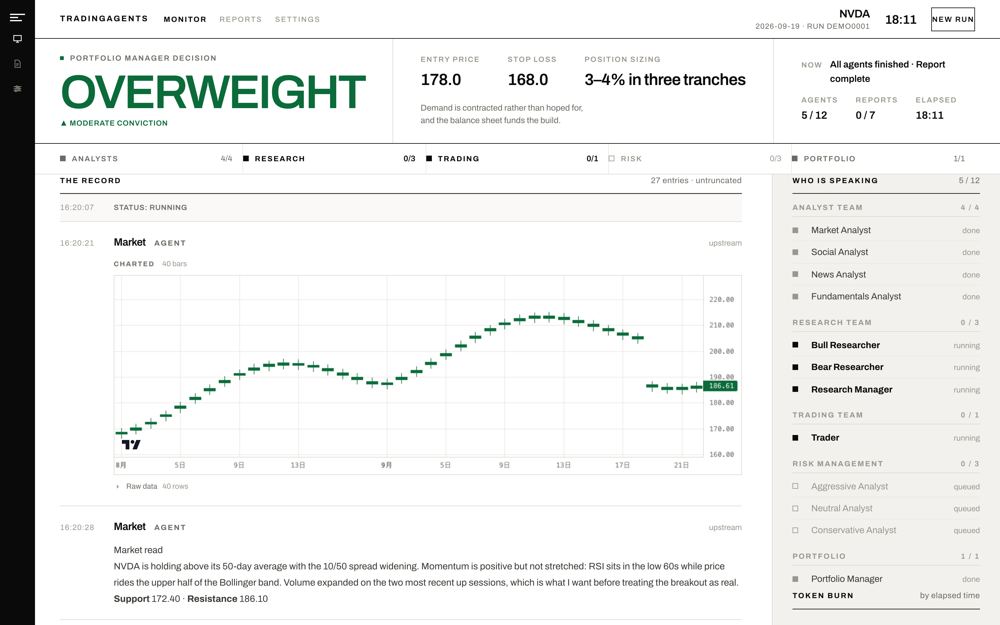
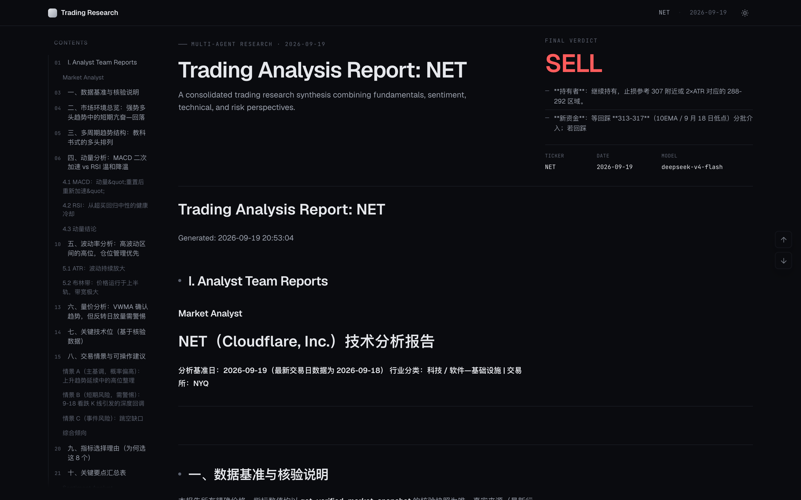
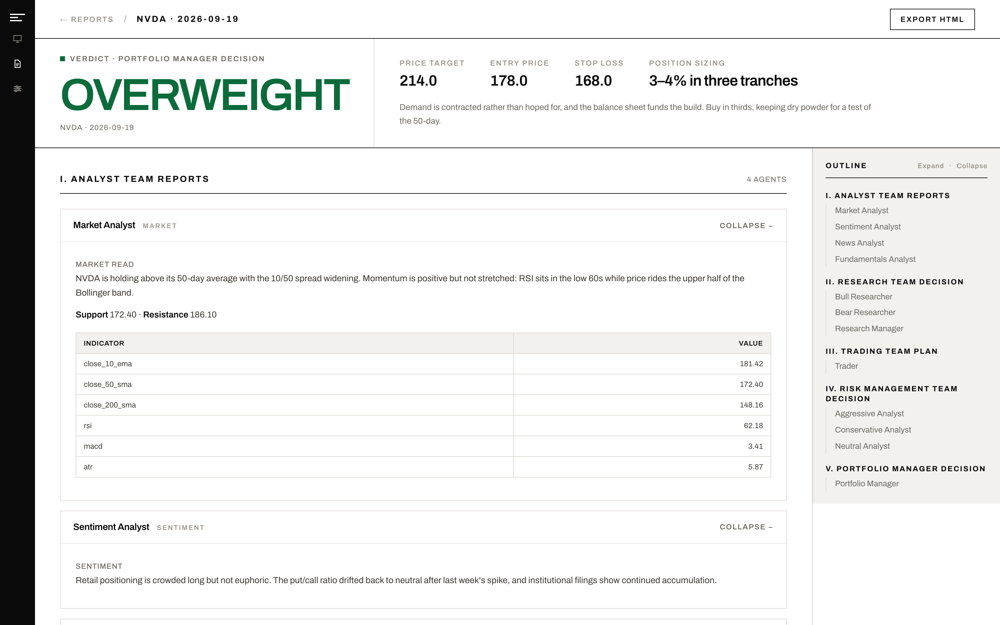
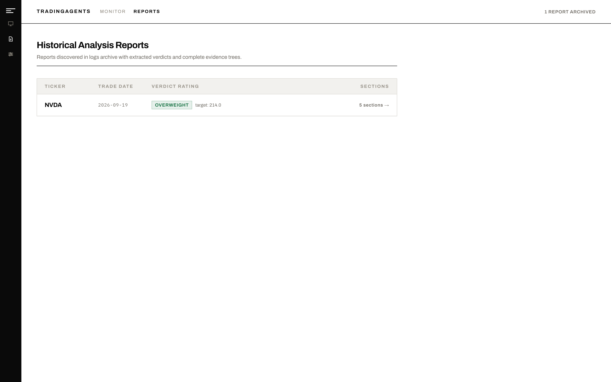
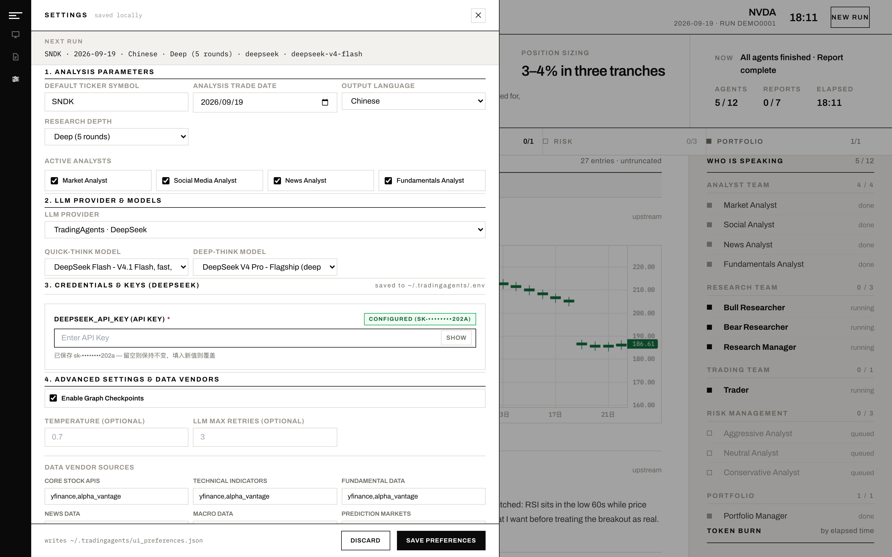

# TradingAgents UI

一个用于运行 [TradingAgents](https://github.com/TauricResearch/TradingAgents) 分析并阅读报告的本地 Web 应用。界面是由 FastAPI 后端提供的 React 单页应用，分析引擎是未做修改的上游 `tradingagents` 包。

[English](README.md)

**兼容 TradingAgents v0.5.0**



## 快速开始

需要 Python 3.10+、[uv](https://docs.astral.sh/uv/) 和 Node.js 18+（用于构建前端）。

```bash
git clone https://github.com/Kevoyuan/tradingagents-ui.git
cd tradingagents-ui
uv venv --python 3.11
uv pip install -e .
bash scripts/build-frontend.sh
trade-ui
```

应用启动在 <http://localhost:8501>。

### 启动选项

已安装的命令支持自定义端口和局域网绑定：

```bash
trade-ui --port 9000   # 自定义端口
trade-ui --lan         # 绑定 0.0.0.0，供手机/平板访问
```

详见[局域网访问](docs/lan-access.md)。

### 构建前端

前端使用 React、Vite 和 TypeScript 构建。运行界面或打包前，请先构建静态资源：

```bash
bash scripts/build-frontend.sh
```

编译产物写入 `trade_ui/static/`，并直接打包进 wheel，因此 pip 安装后运行时不需要 Node。

### macOS

```bash
./scripts/install-macos-app.sh
open "TradingAgents UI.app"
```

首次设置完成后，直接打开 `TradingAgents UI.app` 即可。

### Windows

双击 `scripts\launch-local-webapp.bat`。启动器会在需要时创建本地环境并在浏览器中打开应用。

## 第一次运行

1. 打开 **Settings**（左侧栏的齿轮），选择 LLM Provider 和模型。
2. 输入 Provider API Key。保存的 Key 会写入 `~/.tradingagents/.env`。
3. 设置股票代码（如 `NVDA`、`BTC-USD`）、交易日期、输出语言、分析师团队和研究深度。
4. 点击右上角的 **New Run**，确认代码与日期后点击 **Start Run**。

Monitor 页面会实时显示 Agent 进度、流式消息、工具调用、Token 消耗和报告章节。完成后的报告可在 **Reports** 中继续查看。

## 界面截图

### 导出的 HTML 报告



### 报告阅读器



### 历史报告



### Provider 配置



## 核心功能

- 实时多 Agent 分析进度，包含流式消息与工具调用证据
- 根据 Agent 引用的数据生成价格与指标图表
- 股票与加密货币分析路径
- TradingAgents checkpoint/resume
- 原生及自定义 LLM Provider
- Markdown 报告阅读器，一键导出主题化 HTML
- 本地报告历史和模型专属报告文件
- 基于生成价格表的 Token 与成本统计
- 可选的本地 API Key 保存

## API Key 与隐私

本地启动器会启用本地模式。保存偏好或运行分析时，API Key 保存在：

```text
~/.tradingagents/.env
```

在系统支持时，该文件仅允许当前用户读取（mode 600）。Key 不会写入本仓库，只会传给本次运行所选择的 Provider。

报告保存在：

```text
~/.tradingagents/logs/
```

系统允许创建符号链接时，最新完整报告也会链接到 `~/.tradingagents/latest_report.md`。

## TradingAgents 兼容性

当前版本支持 TradingAgents `>=0.5.0,<0.6`，默认安装精确的 `v0.5.0` tag。应用内更新器也会安装提示中显示的同一个 tag。

Provider 元数据和模型选项会尽量直接复用上游 v0.5.0 registry。仅 UI 专用的兼容端点由本项目单独维护。

完整的已验证上游版本与接口符号契约矩阵见 [COMPATIBILITY.md](COMPATIBILITY.md)。

## 文档

- [兼容性矩阵](COMPATIBILITY.md)
- [安装与其他启动方式](docs/installation.md)
- [Provider 与凭据](docs/providers.md)
- [局域网访问](docs/lan-access.md)
- [开发说明](docs/development.md)

## 开发

```bash
uv pip install -e .
bash scripts/build-frontend.sh
pytest tests/
pytest tradingagents_contract/
ruff check .
```

架构、环境变量和开发用法见 [docs/development.md](docs/development.md)。
